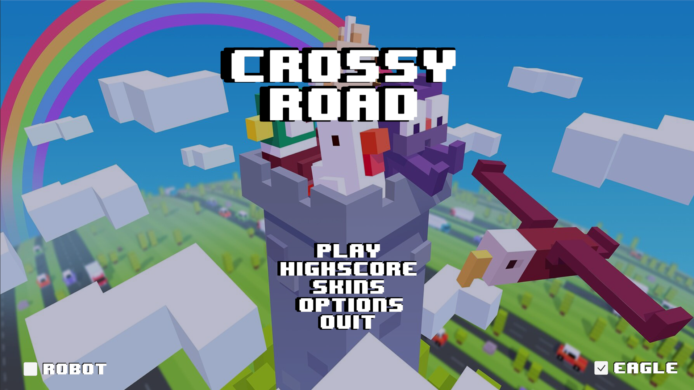
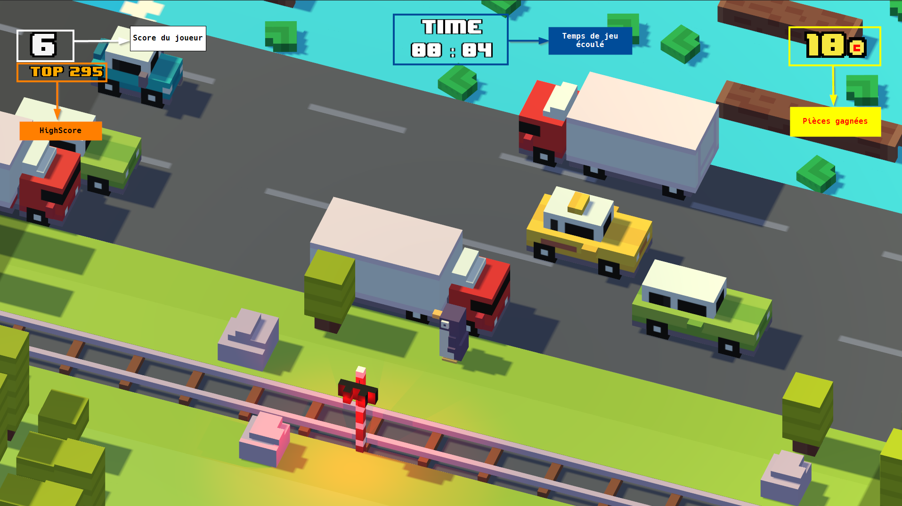
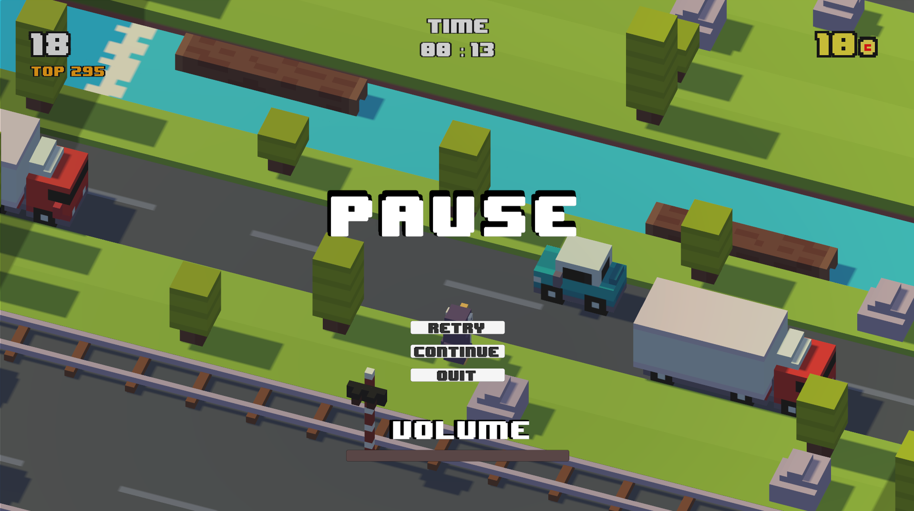
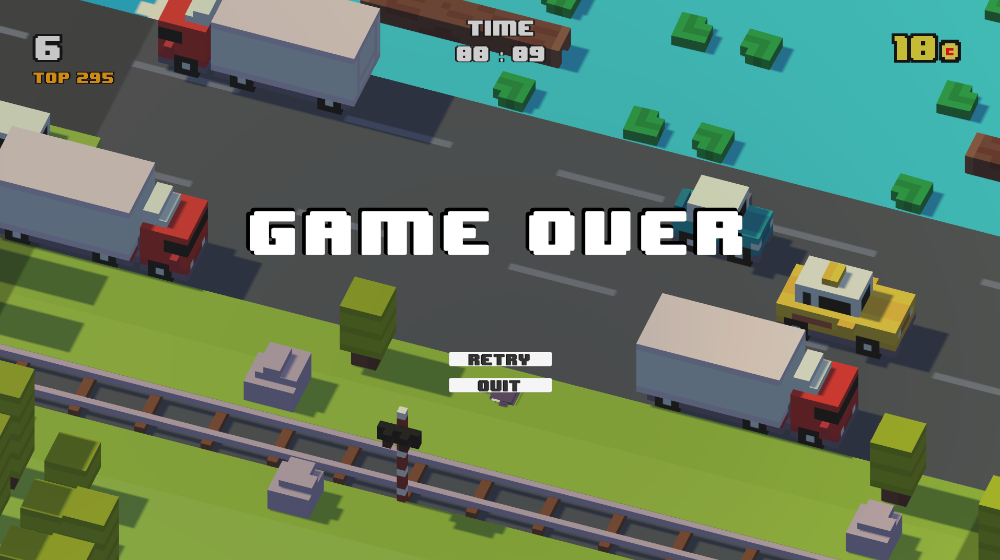
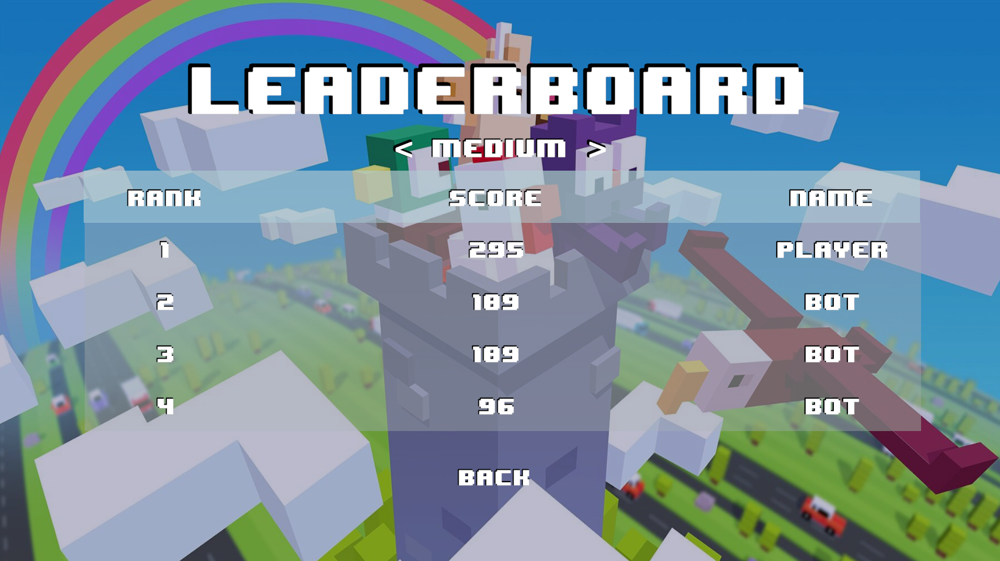
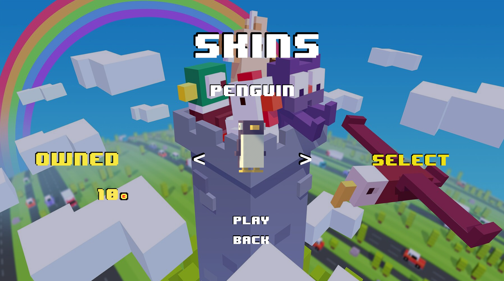
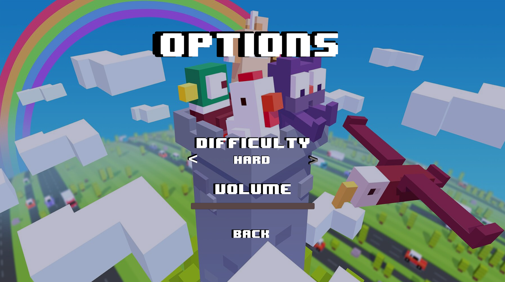
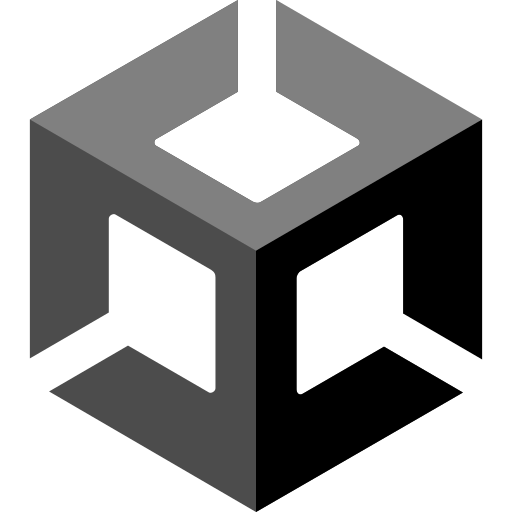

<h1>PROJET CROSSY ROAD :car:</h1>

## :page_with_curl: Sommaire
- [:star: Introduction](#star-introduction)
- [:chart_with_upwards_trend: Analyse UML](#chart_with_upwards_trend-analyse-uml)
    - [Diagramme de classe](#diagramme-de-classe)
    - [Diagramme activite 1: Player](#diagramme-activite-1-player)
    - [Diagramme activite 2: Robot](#diagramme-activite-2-robot)
    - [Diagramme de cas d'utilisation](#diagramme-de-cas-dutilisation)
    - [Diagramme d'état transition](#diagramme-détat-transition)
- [:pencil: Gestion du projet](#pencil-gestion-du-projet)
    - [Planification du projet](#planification-du-projet)
        - [Diagramme de Gantt initial](#diagramme-de-gantt-initial)
        - [Diagramme de Gantt final](#diagramme-de-gantt-final)
    - [Organisation du projet sous Git](#organisation-du-projet-sous-git)
    - [Réalisation du projet](#réalisation-du-projet)
- [:thumbsdown: Difficultés rencontrés](#thumbsdown-difficultés-rencontrés)
- [:notebook: Documentation utilisateur](#notebook-documentation-utilisateur)
    - [Menu principal](#menu-principal)
    - [In-game](#in-game)
        - [Déplacement du joueur](#déplacement-du-joueur)
        - [Evitez les ennemis](#evitez-les-ennemis)
        - [Pause du jeu](#pause-du-jeu)
        - [Game Over](#game-over)
    - [Highscore](#highscore)
    - [Skins](#skins)
    - [Options](#options)
- [🤖 Le Robot](#🤖-le-robot)
- [:computer: Technologies utilisées](#computer-technologies-utilisées)
- [:trollface: Contributors](#trollface-contributors)

## :star: Introduction
Ce projet intitulé "**CROSSY ROAD**" consiste à produire un jeu vidéo qui reprend le jeu [Crossy Road](https://www.crossyroad.com/) avec quelques personnalisations.
Aussi, comme objectif, ce projet nous incite à développer un robot qui est capable de jouer au jeu malgré la difficulté imposé.

Par ailleurs, ce projet nous permet également de mettre en pratique et d'approfondir nos compétences en gestion de projet en tenant en considération :
- La [répartition des tâches](https://github.com/orgs/CrossyRoad-cnam/projects/2/views/3) sur `GitHub`
- L'organisation du [code source](https://github.com/CrossyRoad-cnam/CrossyRoad-Project) avec `git`
- Travail en mode `Agile` avec la gestion des issues par sprint grâce à des [milestones définis](https://github.com/CrossyRoad-cnam/CrossyRoad-Project/milestones?state=closed).
- Maintien du [tableau Kanban](https://github.com/orgs/CrossyRoad-cnam/projects/2) sur `GitHub`

Avant d'entamer le développement du jeu et de mieux appréhender la conception du jeu, des diagrammes UML ont été réalisés dont :
- Diagramme de classe: pour comprendre comment les classes interagissent entre eux, et se baser sur ce diagramme pour développer le moteur du jeu principal.
- Diagramme d'activité 1: pour expliquer la logique de jeu que le joueur fera face par rapport à son environnement.
- Diagramme d'activité 2: spécifique au robot implémentant sa logique de déplacement
- Diagramme de cas d'utilisation: pour détailler les différentes actions que l'utilisateur puisse effectuer sur l'UI du jeu allant du Menu vers l'in-game du jeu
- Diagramme d'états transition

Enfin, une grande partie du projet fut consacrée sur la prise en main et l'apprentissage du moteur de jeu utilisé pour développer le jeu qui est : [Unity3D](https://unity.com/fr), et des outils de modelisation 3D comme [Blender](https://www.blender.org/) et de Voxel ([MagicaVoxel](https://ephtracy.github.io/)) pour pouvoir répliquer de manière quasi identique le jeu niveau visuel.

## :chart_with_upwards_trend: Analyse UML
Dans le cadre de l'analyse UML, comme cité précédemment, ci-dessous les différents diagrammes que nous avons réalisé dans le cadre de ce projet dont : diagramme de classe, diagramme d'activité, diagramme de cas d'utilisation, diagramme d'états transition.

### Diagramme de classe

**Pourquoi classe Player en Singleton ?**

Etant la classe central du jeu, et que dans un jeu comme Crossy Road, il n'existe qu'une seule instance de Player. Cette classe n'a pas vocation à être instancié dans d'autres classes. Ainsi, pour ce faire, cette classe a été conçue en tant que `classe static` dans le code à la manière d'Unity.

### Diagramme activite 1: Player

### Diagramme activite 2: Robot

### Diagramme de cas d'utilisation

### Diagramme d'état transition

## :pencil: Gestion du projet
Pour la gestion du projet, plusieurs étapes étaient réalisées, allant de la planification du projet avec les comptes rendus disponibles dans les CR disponible dans le [dossier](https://github.com/CrossyRoad-cnam/Docs/tree/main/compte-rendu-reunion) associé, vers la réalisation du projet pilotée avec la gestion des issues et méthologie Agile grâce au milestones sur GitHub.

### Planification du projet
Pour façonner la planification du projet, nous avons réalisé un diagramme de Gantt initial pour prévoir les différentes réalisations du projet.
Cependant, comme dans tout projet, il existe des aléas qui influencent la réalisation du projet, et créant donc un écart significatif entre le Gantt initial et le Gantt final.

L'un des plus grands écarts remarqués se situent à l'uniformisation du projet auquel nous avons pris du **retard** dans le fait que chaque membre du groupe ont chacun leur rythme d'apprentissage pour la **Prise en main Unity**.

Aussi, certaines tâches et réalisations fut ajoutées dans le Diagramme de Gantt, auquel formalisé comme étant une **[Roadmap](https://github.com/orgs/CrossyRoad-cnam/projects/2/views/2)** sous GitHub. Et réciproquement, certaines tâches ont également était retirés de la planification/Diagramme, notamment ceux qui n'étaient pas de base dans le **[CAHIER DES CHARGES](cahier-des-charges/Projet_Crossy_Road.pdf)**, ce que donc l'équipe jugeait comme étant optionnel et donc ayant peu d'impact sur le projet.

Ainsi, pour visualiser la planification et la réalité ed la réalisation du projet, ci-dessous le diagramme de Gantt initial et le Diagramme de Gantt final.

#### Diagramme de Gantt initial

#### Diagramme de Gantt final

Pour le diagramme final, il est accessible sous notre projet Git via le lien suivant : [Diagramme de Gantt final](https://github.com/orgs/CrossyRoad-cnam/projects/2/views/2).

### Organisation du projet sous Git
Pour l'organisation du projet sous le Git, nous avons suivi une méthodologie structurée comportant plusieurs branches:
- La [branche principale](https://github.com/CrossyRoad-cnam/CrossyRoad-Project) (main) est protégée et n'accepte que le code fonctionnel et stable.
- La [branche de développement](https://github.com/CrossyRoad-cnam/CrossyRoad-Project/tree/develop) (develop) intègre les avancées du projet et les jalons (milestones).
- En complément, plusieurs autres branches, soit nominatives, soit basées sur des fonctionnalités spécifiques, ont été créées pour permettre des tests approfondis et des modifications susceptibles de casser le code temporairement.

### Réalisation du projet
Pour la réalisation du projet, dans son ensemble chacun ont pris leur responsabilité pour développer le jeu et mener à bien le projet:
- [@Dinholu](https://github.com/Dinholu/), alias Alizée H., dans son rôle de chef de projet, s'occupait majoritairement du pilotage du projet en programmant en avance les différentes réunions hebdomadaires pour la revue des issues et du code. Des sprints ont donc été définies en des milestones, et que chacun devait réussir à clore leur issue pour pouvoir atteindre notre objectif. En terme de développement, elle s'occupait grandement de la gestion du son du jeu, la revue et refactorisation du code pour maintenir la lisibilité du code, la mise en place du menu principal et de ses différentes options et le développement/optimisation de la détection du robot.
- [@EpitronX](https://github.com/EpitronX/), alias Jérémie M., dans son rôle de développeur, était celui qui se chargeait du développement de l'algorithme de spawn des objets sur le terrain, l'algorithme de détection de train et l'émet de signal d'arrivée du train, la gestion de la caméra du jeu et mise en place des bordures de jeu.
- [@WRKT](https://github.com/WRKT), alias Winness R., dans son rôle de développeur, a pris en charge la modélisation graphique du jeu et des différents modèles avec Blender. Son objectif principal étant de vouloir répliquer à l'identique le jeu originel de son mieux. Aussi, il participait à optimisation de l'algorithme de génération de terrain, création du personnage principal et de son ennemi (aigle), optimisation des différentes collisions du jeu, et développement du robot.

## :thumbsdown: Difficultés rencontrés
Tout au long du projet, plusieurs difficultés ont été rencontrées, notamment dû au manque de compétences sur Unity de l'équipe, et encore le temps de formation sur la technologie.
Aussi, dû à ce manque de connaissance, plusieurs bonnes pratiques de Unity n'ont pas été appliquées au projet.

Par ailleurs, des difficultés ont été rencontrés également en terme d'organisation, notamment sur la communication au sein de l'équipe où les disponibilités de chacun n'étaient pas forcément évidente. Aussi, comme chaque membre ont leur propre compétences et capacité sur un sujet donnée, quelques issues ont donc été redistribués et modifiés en assignation pour pouvoir mener à bien le projet.

Enfin, en terme technique, les plus grosses difficultés que nous avons rencontrés sont :
- Non utilisation de l'axe Z comme étant l'axe pour avancer et non l'axe X que nous avions décider
- Mauvaise exploitation des fonctions `Start()` et `Awake()` où normalement, `Awake` serait plus optimale pour l'instanciation des variables.
- La gestion de la collision avec les `Raycasts` pour les obstacles
- Le développement du robot et la détection précoce des objets mouvants pour optimiser ses décisions
- Algorithme de déplacement du robot sur l'environnment et son implémentation
- Gestion de l'animation du joueur que ce soit pour l'effet de saut et à la mort du personnage
- Gestion du cycle de vie de joueur qui ne devait pas être directement détruit suite à sa mort car pouvant entraver l'animation.

## :notebook: Documentation utilisateur
Comment jouer à notre jeu Crossy Road ? :fire: Pour ce faire, suivez le guide suivant :

### Menu principal

Sur le menu principal, vous pouvez effectuer différentes actions selon le bouton cliqué.
- Cliquez sur le bouton `PLAY` pour lancer directement le jeu avec le skin par défaut (Chicken) et les paramètres par défaut (difficulté: medium, volume: 50%)
- Cliquez sur le bouton `HIGHSCORE` pour accéder au Leaderboard du jeu classé PAR difficulté, détaillé dans la section Highscore.
- Cliquez sur le bouton `SKINS` pour choisir la mascotte du personnage à jouer, débloquable avec la monnaie du jeu, que vous pourrez gagner en jouant.
- Cliquez sur le bouton `OPTIONS` pour modifier les paramétrages du jeu, dont la difficulté du jeu, mais aussi le volume des sons du jeu (notamment celui du saut! :trollface:)
- Cochez sur `ROBOT` pour activer le mode ROBOT et appréciez le robot jouer lui-même, bon il n'est pas parfait, mais parfois agréable à voir ses mouvements.
- Cochez sur `EAGLE` pour activer ou non l'aigle qui attaque le joueur en cas d'inactivité. :no_entry: ATTENTION, si vous aimez le challenge, vaudrait mieux l'activer.
- Cliquez sur le bouton `QUIT` pour quitter le jeu.

### In-game

Dans l'in-game, vous trouverez sur l'image précédente les différentes informations nécessaires du Dashboard.
#### Déplacement du joueur
- Appuyez sur la touche directionnelle `HAUT` ou `Z` pour avancer
- Appuyez sur la touche directionnelle `BAS` ou `S` pour reculer
- Appuyez sur la touche directionnelle `GAUCHE` ou `Q` pour aller vers le gauche
- Appuyez sur la touche directionnelle `DROITE` ou `D` pour aller vers la droite.

#### Evitez les ennemis :skull: 
Faites de votre mieux pour éviter les ennemis, et portez une attention particulière sur le déplacement des bûches sur l'eau, ils peuvent vous porter défaut si vous ne vous en souciez pas.

#### Pause du jeu
Appuyez sur la touche `ECHAP` pour activer mettre le jeu en Pause.

Dans ce menu, vous pouvez : 
- Cliquez sur `RETRY` pour recommencer le jeu depuis le début.
- Cliquez sur `CONTINUE` si vous avez terminer de boire votre café et reprendre le jeu.
- Cliquez sur `QUIT` pour revenir au Menu principal du jeu
- Modifier le volume du jeu avec le slider.

Comme dans l'in-game, vous pouvez continuer de visualiser le temps de jeu écoulé, le score, et les pièces que vous avez gagné durant la partie.

#### Game Over
Dans le cas où vous êtes mort, peu importe la raison, skill issue accepté :satisfied:, l'écran suivant apparaitra avec un son qui devrait vous rappeler votre belle enfance.

Et comme pour le menu Pause précédemment :
- Cliquez sur `RETRY` pour recommencer le jeu depuis le début.
- Cliquez sur `QUIT` pour revenir au Menu principal du jeu

### Highscore
Maintenant vient le leaderboard! N'hésitez pas à battre votre score et devenir le top 1 dans le leaderboard comme dans les vieux jeux d'arcade :video_game:.
Mentionné précédemment, le leaderboard est accessible que depuis le menu principal du jeu.

Vous pouvez consulter les différents leaderboards selon la difficulté que vous avez choisi. Ainsi, l'équipe de développement du jeu vous invite à réussir au moins 100 points dans la difficulté `Difficile`.

### Skins

Dans le menu skin, vous pourrez modifier la mascotte de votre personnage. Attention, rien n'est gratuit dans la vie à part les personnages suivants :
- Chicken, personnage principal, qui décide de traverser une route aussi dangereuse...
- Duck, ami du canard et grand rival, qui veut aller toujours plus loin que le poulet, mais à quel prix...
- Penguin, parce qu'on aime les pinguoins, vive les pinguoins! Vive Tux! Vive Linux!!

Si vous êtes assez bon sur le jeu, vous aurez encore plus de choix sur le jeu, il y existe actuellement **21 skins** sur le jeu! Ainsi sur ce menu :
- Cliquez sur `BUY` pour acheter les skins
- Cliquez sur `SELECT` pour sélectionner le skin vu sur l'écran.
- Cliquez sur `PLAY` pour lancer directement le jeu
- Cliquez sur `BACK` pour revenir au menu précédent pour affiner d'autres réglages.

### Options

Sur ce menu, vous pourrez:
- Modifier la difficulté du jeu en cliquant sur les flèches présents
- Modifiez le volume du jeu
- Cliquez sur `BACK` pour revenir au menu précédent.

## 🤖 Le Robot
Le robot, le bot, l'IA, cette partie du projet fut la plus fastidieuse, et celui qui demandait le plus d'attention, de logique, d'algorithme.

En effet, dans le développement du jeu, depuis le début, nous avons choisi de faire recours aux `raycasts` pour la détection des collisions, mais non uniquement avec les colliders.

En utilisant donc cette même logique de détection, nous avons développé le robot autour des `raycasts` pour la détection de son envrionnement que ce soit pour les Obstacles, les véhicules, les trains, et l'eau.

Quelques démos:
- [Mouvement sur eau](assets/robot/Robot-eau.mp4)
- [Mouvement sur route](assets/robot/Robot-road.mp4)
- [Mouvement sur rails](assets/robot/Robot-train.mp4)

## :computer: Technologies utilisées

## :trollface: Contributors
- [@Dinholu](https://github.com/Dinholu/), alias **Alizée Hett**
- [@EpitronX](https://github.com/EpitronX/), alias **Jérémie Moser**
- [@WRKT](https://github.com/WRKT), alias **Winness Rakotozafy**