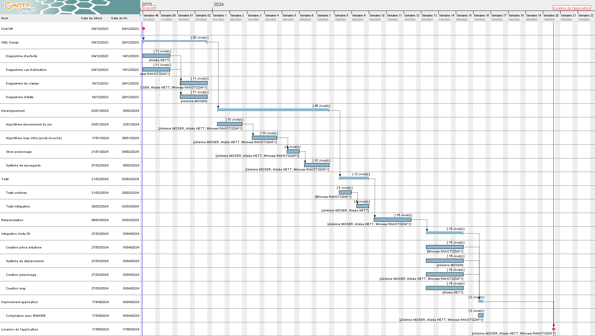

# 🐧 PROJET CROSSY ROAD 🐧

## Introduction
Ce projet intitulé "**CROSSY ROAD**" consiste à produire un jeu vidéo qui reprend le jeu [Crossy Road](https://www.crossyroad.com/) avec quelques personnalisations.
Aussi, comme objectif, ce projet nous incite à développer un robot qui est capable de jouer au jeu malgré la difficulté imposé.

Par ailleurs, ce projet nous permet également de mettre en pratique et d'approfondir nos compétences en gestion de projet en tenant en considération :
- La [répartition des tâches]() sur `GitHub`
- L'organisation du [code source](https://github.com/CrossyRoad-cnam/CrossyRoad-Project) avec `git`
- Travail en mode `Agile` avec la gestion des issues par sprint grâce à des [milestones définis](https://github.com/CrossyRoad-cnam/CrossyRoad-Project/milestones?state=closed).
- Maintien du [tableau Kanban](https://github.com/orgs/CrossyRoad-cnam/projects/2) sur `GitHub`

Avant d'entamer le développement du jeu et de mieux appréhender la conception du jeu, des diagrammes UML ont été réalisés dont :
- Diagramme de classe: pour comprendre comment les classes interagissent entre eux, et se baser sur ce diagramme pour développer le moteur du jeu principal.
- Diagramme d'activité 1: pour expliquer la logique de jeu que le joueur fera face par rapport à son environnement.
- Diagramme d'activité 2: spécifique au robot implémentant sa logique de déplacement
- Diagramme de cas d'utilisation: pour détailler les différentes actions que l'utilisateur puisse effectuer sur l'UI du jeu allant du Menu vers l'in-game du jeu
- Diagramme d'états transition
- Diagramme de séquence

Enfin, une grande partie du projet fut consacrée sur la prise en main et l'apprentissage du moteur de jeu utilisé pour développer le jeu qui est : [Unity3D](https://unity.com/fr), et des outils de modelisation 3D comme [Blender](https://www.blender.org/) et de Voxel ([MagicaVoxel](https://ephtracy.github.io/)) pour pouvoir répliquer de manière quasi identique le jeu niveau visuel.

## Analyse UML
Dans le cadre de l'analyse UML, comme cité précédemment, ci-dessous les différents diagrammes que nous avons réalisé dans le cadre de ce projet dont : diagramme de classe, diagramme d'activité, diagramme de cas d'utilisation, diagramme d'états transition.

### Diagramme de classe

#### Argumentation du choix d'architecture
- **Classe Player en Singleton** : étant la classe central du jeu, et que dans un jeu comme Crossy Road, il n'existe qu'une seule instance de Player. Cette classe n'a pas vocation à être instancié dans d'autres classes. Ainsi, pour ce faire, cette classe a été conçue en tant que classe static dans le code à la manière d'Unity.

### Diagramme activite 1: Player

### Diagramme activite 2: Robot

### Diagramme de cas d'utilisation

### Diagramme d'état transition

## Gestion du projet
Pour la gestion du projet, plusieurs étapes étaient réalisées, allant de la planification du projet avec les comptes rendus disponibles dans les CR disponible dans le [dossier](https://github.com/CrossyRoad-cnam/Docs/tree/main/compte-rendu-reunion) associé, vers la réalisation du projet pilotée avec la gestion des issues et méthologie Agile grâce au milestones sur GitHub.

### Planification du projet
Pour façonner la planification du projet, nous avons réalisé un diagramme de Gantt initial pour prévoir les différentes réalisations du projet.
Cependant, comme dans tout projet, il existe des aléas qui influencent la réalisation du projet, et créant donc un écart significatif entre le Gantt initial et le Gantt final.

L'un des plus grands écarts remarqués se situent à l'uniformisation du projet auquel nous avons pris du **retard** dans le fait que chaque membre du groupe ont chacun leur rythme d'apprentissage pour la **Prise en main Unity**.

Aussi, certaines tâches et réalisations fut ajoutées dans le Diagramme de Gantt, auquel formalisé comme étant une **[Roadmap](https://github.com/orgs/CrossyRoad-cnam/projects/2/views/2)** sous GitHub. Et réciproquement, certaines tâches ont également était retirés de la planification/Diagramme, notamment ceux qui n'étaient pas de base dans le **[CAHIER DES CHARGES](cahier-des-charges/Projet_Crossy_Road.pdf)**, ce que donc l'équipe jugeait comme étant optionnel et donc ayant peu d'impact sur le projet.

Ainsi, pour visualiser la planification et la réalité ed la réalisation du projet, ci-dessous le diagramme de Gantt initial et le Diagramme de Gantt final.

#### Diagramme de Gantt initial

#### Diagramme de Gantt final

### Organisation du projet sous Git
Pour l'organisation du projet sous le Git, nous avons suivi une méthodologie structurée comportant plusieurs branches:
- La [branche principale](https://github.com/CrossyRoad-cnam/CrossyRoad-Project) (main) est protégée et n'accepte que le code fonctionnel et stable.
- La [branche de développement](https://github.com/CrossyRoad-cnam/CrossyRoad-Project/tree/develop) (develop) intègre les avancées du projet et les jalons (milestones).
- En complément, plusieurs autres branches, soit nominatives, soit basées sur des fonctionnalités spécifiques, ont été créées pour permettre des tests approfondis et des modifications susceptibles de casser le code temporairement.

### Réalisation du projet

## Difficultés rencontrés
Tout au long du projet, plusieurs difficultés ont été rencontrées, notamment dû au manque de compétences sur Unity de l'équipe, et encore le temps de formation sur la technologie.
Aussi, dû à ce manque de connaissance, plusieurs bonnes pratiques de Unity n'ont pas été appliquées au projet.

Par ailleurs, des difficultés ont été rencontrés également en terme d'organisation, notamment sur la communication au sein de l'équipe où les disponibilités de chacun n'étaient pas forcément évidente. Aussi, comme chaque membre ont leur propre compétences et capacité sur un sujet donnée, quelques issues ont donc été redistribués et modifiés en assignation pour pouvoir mener à bien le projet.

Enfin, en terme technique, les plus grosses difficultés que nous avons rencontrés sont :
- Non utilisation de l'axe Z comme étant l'axe pour avancer
- Mauvaise exploitation des Start et Awake où normalement, Awake serait plus optimale pour l'instanciation des variables.
- La gestion de la collision avec les Raycasts pour les obstacles
- Le développement du robot et la détection précoce des objets mouvants pour optimiser ses décisions
- Algorithme de déplacement du robot sur l'environnment
- Gestion de l'animation du joueur que ce soit pour l'effet de saut et à la mort du personnage
- Gestion du cycle de vie de joueur qui ne devait pas être directement détruit suite à sa mort car pouvant entraver l'animation.

## Documentation utilisateur

## Technologies utilisées

## CONTRIBUTORS
@EpitronX alias Jeremie Moser
@Dinholu alias Alizée Hett
@WRKT alias Winness Rakotozafy